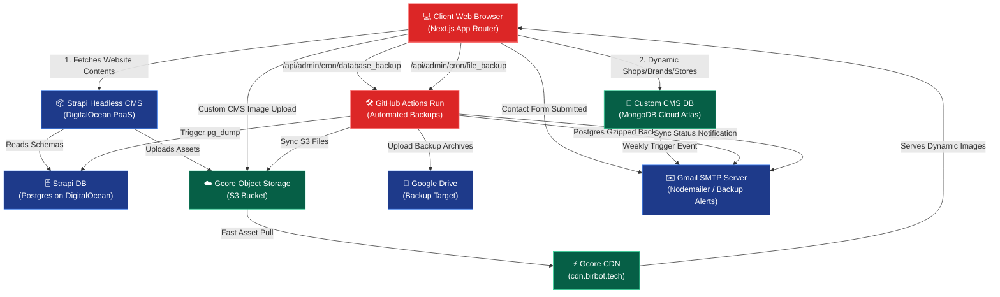

# System Architecture & Workflows Specification

Welcome to the official system architecture and workflow specification. This document outlines the dynamic data pipelines, cloud services, headless and custom content management systems, automated messaging triggers, and backup recovery pipelines.

---

## 1. High-Level Architecture Flowchart

The following diagram illustrates how the Frontend (Next.js), Content Management Systems (Strapi on DigitalOcean & Custom MongoDB CMS), CDN Storage, MongoDB Triggers, and GitHub Actions Automated Backups interact:

---

## 2. Headless CMS & Database Pipelines

The system separates standard website layouts and editorial contents from transaction-level field operations:

### A. Strapi Headless CMS (Hosted on DigitalOcean)
*   **Purpose:** Manages static marketing blocks, home hero layouts, FAQ pages, promotional cards, and standard website copy.
*   **Database:** Connected to a managed **Postgres Database** on DigitalOcean.
*   **Public Access:** Exposes `find` and `findOne` endpoints publicly to Next.js using dynamic page content fetches.

### B. Custom Content Management System (MongoDB)
*   **Purpose:** Handles custom field operations, brands portfolio, stores map coordinates, and secure field personnel Visicooler audits.
*   **Database:** Hosted on **MongoDB Atlas** using dynamic Mongoose schemas.
*   **Security Portal:** Secure Visicooler pages (`/visicooler`, `/visicooler/createshop`, `/visicooler/[id]`) are protected by a single-field login that dynamically cross-verifies Area Sales Managers (ASM) and Sales Executives (SE) against database-enrolled entries.

---

## 3. Media & Content Delivery Network (CDN)

To optimize load speeds globally and reduce primary hosting bandwidth consumption:
*   **Object Storage:** All images, videos, and PDFs uploaded via the Strapi CMS or our Custom CMS are stored directly in a **Gcore S3 Cloud Bucket** (`cocacola-bucket`).
*   **Unified CDN Host:** We have configured a premium **Gcore CDN** (`https://cdn.birbot.tech`) that wraps around the Gcore S3 bucket endpoint.
*   **Caching & Optimization:** Media assets are requested and rendered on the client browser exclusively using the CDN hostname, guaranteeing sub-millisecond response times.

---

## 4. Automated Triggers & Email Notifications

Automated pipelines are running continuously to ensure reliable communications and data auditing:

### A. Contact Us & Distributor Inquiries
*   When a client submits a form at `/contactus` or a distributor applies at `/become-our-distributor`, Next.js API endpoints connect via secure **SMTP (Nodemailer)**.
*   An instant transactional email containing full submission parameters is sent to the designated support mailbox (`vibin@thecloud9corp.com`, `sainidivanshsingh123@gmail.com`).

### B. MongoDB Database Triggers (Weekly Reports)
*   A scheduled **MongoDB Cloud Trigger (Cron)** is configured on the database cluster.
*   **Frequency:** Once a week.
*   **Task:** Generates a complete database report compiling active visicooler shops, brand catalogs, and new store listings, and dispatches it automatically to the administrative team's inbox.

---

## 5. GitHub Actions Backup & Recovery Workflows

For business continuity and disaster recovery, we have setup fully automated backup pipelines triggered securely via Next.js REST API cron dispatchers to **GitHub Actions**:

### A. Database Backup (`postgres-backup.yml`)
*   **Dispatcher:** `/api/admin/cron/database_backup`
*   **Process:** 
    1. The API endpoint validates requests and uses a secure `GITHUB_TOKEN` to dispatch a workflow run in the repository.
    2. GitHub Action starts a runner that executes `pg_dump` against the DigitalOcean Postgres database using `DATABASE_URL`.
    3. The dump is compressed into a `.sql.gz` archive.
    4. The archive is emailed directly to the administrative inbox (`divansh.core@gmail.com`) using custom Nodemailer SMTP configurations on the runner.

### B. Media Assets Backup (`GcoreToGdrive.yml`)
*   **Dispatcher:** `/api/admin/cron/file_backup`
*   **Process:**
    1. Next.js dispatches the `GcoreToGdrive` workflow in the GitHub repository.
    2. The workflow spins up a backup runner that connects to the **Gcore S3 Cloud Bucket**.
    3. It archives all directories (`brands`, `products`, `stores`, `visicooler`) and copies the files directly to a designated **Google Drive** storage folder.
    4. Dispatches an email notification to the administrator's Gmail indicating sync success status.
